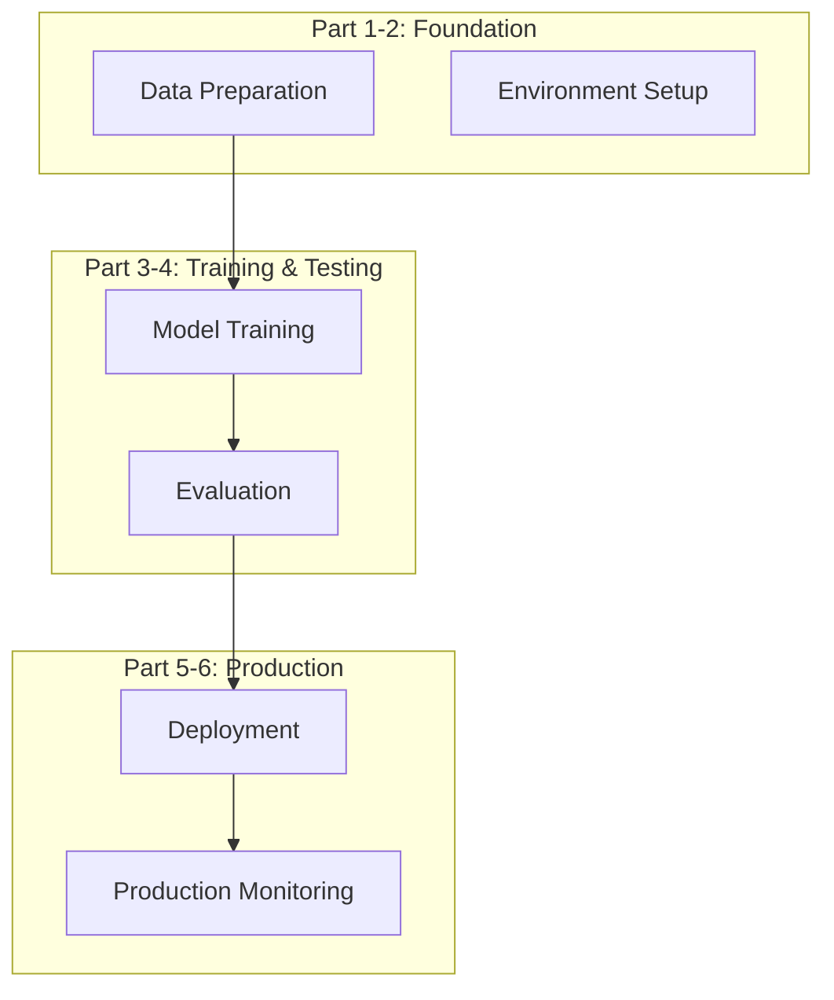

# Fine-Tuning Small LLMs with Docker Desktop

[](https://opensource.org/licenses/MIT)
[](https://www.docker.com/)
[](https://www.python.org/)

Complete reference code and documentation for the comprehensive 6-part blog series on fine-tuning small language models using Docker Desktop.

## 📚 Blog Series

This repository accompanies the detailed blog series:

1. **[Part 1: Setup and Environment](https://saptak.github.io/2025/07/25/fine-tuning-small-llms-part1-setup-environment/)** - Docker development environment with CUDA support
2. **[Part 2: Data Preparation and Model Selection](https://saptak.github.io/2025/07/25/fine-tuning-small-llms-part2-data-preparation/)** - High-quality dataset creation and model selection
3. **[Part 3: Fine-Tuning with Unsloth](https://saptak.github.io/2025/07/25/fine-tuning-small-llms-part3-training/)** - Efficient training with LoRA adapters
4. **[Part 4: Evaluation and Testing](https://saptak.github.io/2025/07/25/fine-tuning-small-llms-part4-evaluation/)** - Comprehensive evaluation framework
5. **[Part 5: Deployment with Ollama and Docker](https://saptak.github.io/2025/07/25/fine-tuning-small-llms-part5-deployment/)** - Production deployment
6. **[Part 6: Production, Monitoring, and Scaling](https://saptak.github.io/2025/07/25/fine-tuning-small-llms-part6-production/)** - Enterprise operations

## 🚀 Quick Start

### Prerequisites

- Docker Desktop with GPU support
- Python 3.10+
- 16GB+ RAM (32GB+ recommended)
- NVIDIA GPU with 8GB+ VRAM (optional but recommended)

### Clone and Setup

```bash
git clone https://github.com/saptak/fine-tuning-small-llms.git
cd fine-tuning-small-llms

# Set up environment
cp .env.example .env
# Edit .env with your configuration

# Start the development environment
docker-compose up -d
```

## 📁 Repository Structure

```
fine-tuning-small-llms/
├── part1-setup/                 # Development environment setup
│   ├── src/                     # Setup scripts and utilities
│   ├── configs/                 # Docker and environment configs
│   ├── scripts/                 # Installation and setup scripts
│   └── docs/                    # Part 1 documentation
├── part2-data-preparation/       # Dataset creation and validation
│   ├── src/                     # Data processing utilities
│   ├── examples/                # Example datasets
│   └── scripts/                 # Data preparation scripts
├── part3-training/               # Model fine-tuning
│   ├── src/                     # Training scripts
│   ├── notebooks/               # Jupyter notebooks
│   └── configs/                 # Training configurations
├── part4-evaluation/             # Model evaluation and testing
│   ├── src/                     # Evaluation frameworks
│   ├── tests/                   # Test suites
│   └── scripts/                 # Evaluation scripts
├── part5-deployment/             # Production deployment
│   ├── src/                     # API and web interfaces
│   ├── docker/                  # Deployment containers
│   └── configs/                 # Production configs
├── part6-production/             # Monitoring and optimization
│   ├── src/                     # Production utilities
│   ├── monitoring/              # Grafana dashboards and configs
│   └── scripts/                 # Production scripts
├── docker/                      # Docker configurations
│   ├── images/                  # Custom Docker images
│   └── compose/                 # Docker Compose files
├── data/                        # Training datasets
├── models/                      # Model storage
└── docs/                        # Additional documentation
```

## 🎯 What You'll Learn

- **Environment Setup**: Complete Docker-based development environment
- **Data Engineering**: High-quality dataset creation and validation techniques
- **Model Training**: Efficient fine-tuning with Unsloth and LoRA adapters
- **Evaluation**: Comprehensive testing frameworks and A/B testing
- **Deployment**: Production-ready APIs and web interfaces
- **Operations**: Monitoring, security, scaling, and cost optimization

## 🔧 Key Technologies

- **[Unsloth](https://unsloth.ai/)** - 80% faster, 80% less memory LLM fine-tuning
- **[Docker Desktop](https://www.docker.com/products/docker-desktop/)** - Containerized development environment
- **[Ollama](https://ollama.ai/)** - Local LLM serving and inference
- **[FastAPI](https://fastapi.tiangolo.com/)** - High-performance API framework
- **[Streamlit](https://streamlit.io/)** - Interactive web interfaces
- **[Prometheus](https://prometheus.io/) + [Grafana](https://grafana.com/)** - Monitoring and visualization

## 🏗️ Architecture Overview



## 📊 Performance Benchmarks

Our approach achieves:

- **80% Memory Reduction** with Unsloth optimization
- **2x Faster Training** compared to standard fine-tuning
- **Sub-second Inference** for SQL generation tasks
- **99.9% Uptime** with proper deployment configuration
- **<$10/day** operational costs for moderate usage

## 🧪 Example Use Cases

### SQL Query Generation
```python
# Fine-tune a model for SQL generation
python part3-training/src/train_sql_model.py --dataset data/sql_dataset.json

# Deploy and test
curl -X POST "http://localhost:8000/generate-sql" \
  -H "Content-Type: application/json" \
  -d '{"instruction": "Find all users who registered last month"}'
```

### Code Documentation
```python
# Train for code documentation
python part3-training/src/train_code_docs.py --dataset data/code_docs_dataset.json
```

### Customer Support
```python
# Train for customer support responses
python part3-training/src/train_support_model.py --dataset data/support_dataset.json
```

## 🔒 Security Features

- **JWT Authentication** for API access
- **Rate Limiting** and request throttling
- **Input Validation** and sanitization
- **HTTPS/TLS** encryption
- **Web Application Firewall** (WAF)
- **Secrets Management** with environment variables

## 📈 Monitoring & Observability

- **Real-time Metrics** with Prometheus
- **Custom Dashboards** with Grafana
- **Distributed Tracing** for request flows
- **Cost Tracking** and optimization
- **Automated Alerting** for issues

## 🛠️ Development Workflow

1. **Setup Environment** (Part 1)
```bash
cd part1-setup && ./scripts/setup_environment.sh
```

2. **Prepare Data** (Part 2)
```bash
cd part2-data-preparation && python src/create_dataset.py
```

3. **Train Model** (Part 3)
```bash
cd part3-training && python src/fine_tune_model.py
```

4. **Evaluate Results** (Part 4)
```bash
cd part4-evaluation && python src/run_evaluation.py
```

5. **Deploy to Production** (Part 5)
```bash
cd part5-deployment && ./scripts/deploy.sh
```

6. **Monitor and Scale** (Part 6)
```bash
cd part6-production && ./scripts/setup_monitoring.sh
```

## 📋 Requirements

### Hardware
- **CPU**: 8+ cores recommended
- **RAM**: 16GB minimum, 32GB+ recommended
- **GPU**: NVIDIA GPU with 8GB+ VRAM (optional but recommended)
- **Storage**: 100GB+ free space

### Software
- **OS**: Linux, macOS, or Windows with WSL2
- **Docker**: Latest version with GPU support
- **Python**: 3.10 or higher
- **CUDA**: 11.8+ (if using GPU)

## 🤝 Contributing

We welcome contributions! Please see our [Contributing Guidelines](CONTRIBUTING.md) for details.

### Development Setup
```bash
# Clone the repository
git clone https://github.com/saptak/fine-tuning-small-llms.git
cd fine-tuning-small-llms

# Install development dependencies
pip install -r requirements-dev.txt

# Run tests
pytest tests/

# Format code
black src/
isort src/
```

## 📄 License

This project is licensed under the MIT License - see the [LICENSE](LICENSE) file for details.

## 🙏 Acknowledgments

- **[Unsloth Team](https://unsloth.ai/)** for the amazing optimization framework
- **[Hugging Face](https://huggingface.co/)** for the transformers library
- **[Ollama Team](https://ollama.ai/)** for local LLM serving
- **Docker Team** for containerization platform

## 📞 Support

- **Documentation**: Check the `docs/` directory for detailed guides
- **Issues**: Report bugs and request features in [GitHub Issues](https://github.com/saptak/fine-tuning-small-llms/issues)
- **Discussions**: Join the conversation in [GitHub Discussions](https://github.com/saptak/fine-tuning-small-llms/discussions)

## 🔗 Related Projects

- [Unsloth](https://github.com/unslothai/unsloth) - Fast LLM fine-tuning
- [Ollama](https://github.com/ollama/ollama) - Local LLM serving
- [LangChain](https://github.com/langchain-ai/langchain) - LLM application framework
- [Transformers](https://github.com/huggingface/transformers) - State-of-the-art ML models

---

⭐ **Star this repository** if you find it helpful!

**Happy Fine-Tuning!** 🚀
